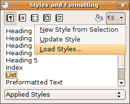

.. ==================================================
.. FOR YOUR INFORMATION
.. --------------------------------------------------
.. -*- coding: utf-8 -*- with BOM.

.. include:: ../../Includes.txt

.. _issues-with-open-office-howto-alternative-import-the:

HowTo: (alternative) Import the styles from another document
------------------------------------------------------------

|image-5| (!) In some old OpenOffice versions (e.g. 2.4) there's a bug: after the import you need
the HowTo “Fix the TOC”
Load your manual, then hit the F11 key to show the styles
Klick on the small arrow top-right
A select box appears , you klick at “Load Styles” and then “From File”
(!) Check all the boxes
Navigate to the “doc_template”/doc” folder and switch the file-type to .sxw
“OpenOffice.org 1.0 Textdocument”
Open the manual.sxw, now you can use the new style!

