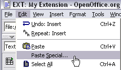

.. ==================================================
.. FOR YOUR INFORMATION
.. --------------------------------------------------
.. -*- coding: utf-8 -*- with BOM.

.. include:: ../../Includes.txt

.. _issues-with-open-office-inserting-images:

Inserting images
----------------

When you insert images you can either:

|image-2| Make a copy/paste from eg. Photoshop, but it's **REALLY IMPORTANT**  that you insert the
image into Open Office by the menu “Edit > Paste Special” and then select “Bitmap”. If you
don't do it in this way the image cannot be shown (since it will not be stored as a PNG internally
in the SXW file)
Alternatively you can use the traditional way “**Insert > Graphics > From file** ” and insert
an image from your harddrive. In particular use this if the image is photographic (JPG) since the
internal storage as PNG is not good for photographs.

Generally please use copy/paste only for screendumps with large areas of similar color (good
png-compression) and JPG-files for photographic images. Go for small images, 72 dpi, medium quality.
