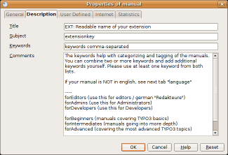

.. ==================================================
.. FOR YOUR INFORMATION
.. --------------------------------------------------
.. -*- coding: utf-8 -*- with BOM.

.. include:: ../../Includes.txt

.. _issues-with-open-office-meta-data-and-updates:

Meta data and updates
---------------------

There are three fields of meta-data you have to fill in. First of all go to “File >
Properties...”. 

In the “Description” screen you enter the title of the document. Extension manuals are
prefixed “EXT: [extension title]”
In the “User defined” screen you enter your email address as the first field (named
“Email” / ”Info 1”)
In the “User defined” screen you enter your full name as the second field (named “Author”
/ ”Info 2”)

Finally you should also insert the correct extension key in the text below the document title, but
this is not a meta-data field, just regular text.
