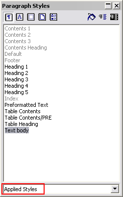

.. ==================================================
.. FOR YOUR INFORMATION
.. --------------------------------------------------
.. -*- coding: utf-8 -*- with BOM.

.. include:: ../../Includes.txt

.. _issues-with-open-office-paragraph-styles:

Paragraph styles
----------------

Use the paragraph style “Text body” for bodytext
Use “Heading 1” to “Heading 5” for headers. “Heading 1-3” will be recognized as
“sections” on typo3.org. “Heading 4-5” is subheaders, where “Heading 5” is preferrably
for “Examples”.
For code listings, use the style “Preformatted Text” (found under “HTML Styles”). For
codelistings in tables there is a custom style called “Table Contents/PRE”.

This screenshot shows the only paragraph styles allowed in the documents. The ones grayed out are
paragraph styles that are used by default for such as the index table or the footer. The others are
the ones you are allowed to use.

